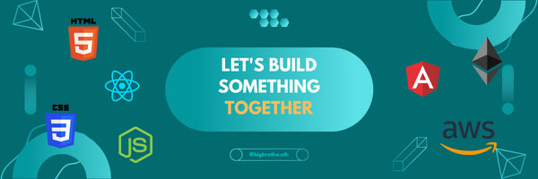

  

# Hello and Welcome

## About Me

- 👋 Hi, I’m Rafael Mendoza and I'm a blockchain developer living in Spain.
- 👀 I’m interested in traveling and have lived in Dominican Republic, United States, Switzerland, China, and Poland.
- 🌱 I have been developing my blockchain development skills since June 2020 with a focus on EVM-compatible applications.
- 🌱 I'm also interested in developing my skills outside of EVM application, into substrate and cosmo blockchain apps.
- 💞️ I’m looking to collaborate on decentralized NFT, GameFi, or DeFi in EVM chains. If you have ideas, let's talk!
- 📫 You can reach me through my website or linkedin profile: 

  
  
  

## Current Project

## Past Projects

